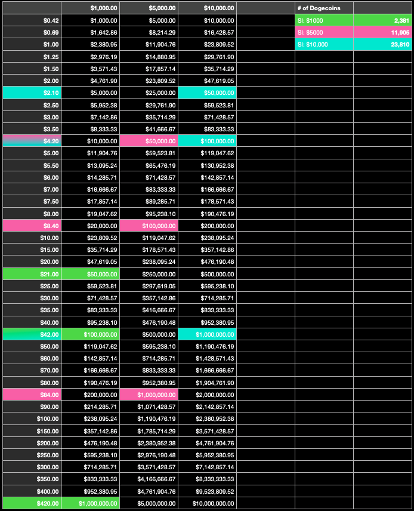
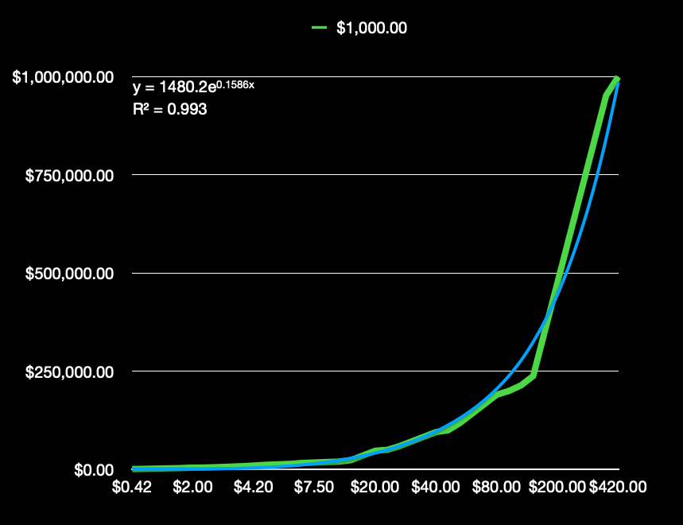
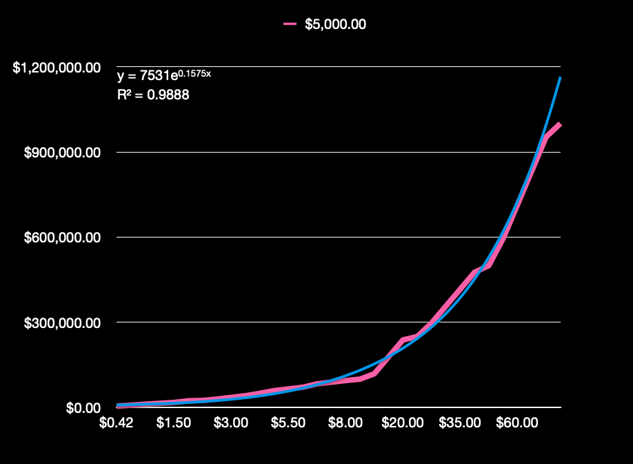
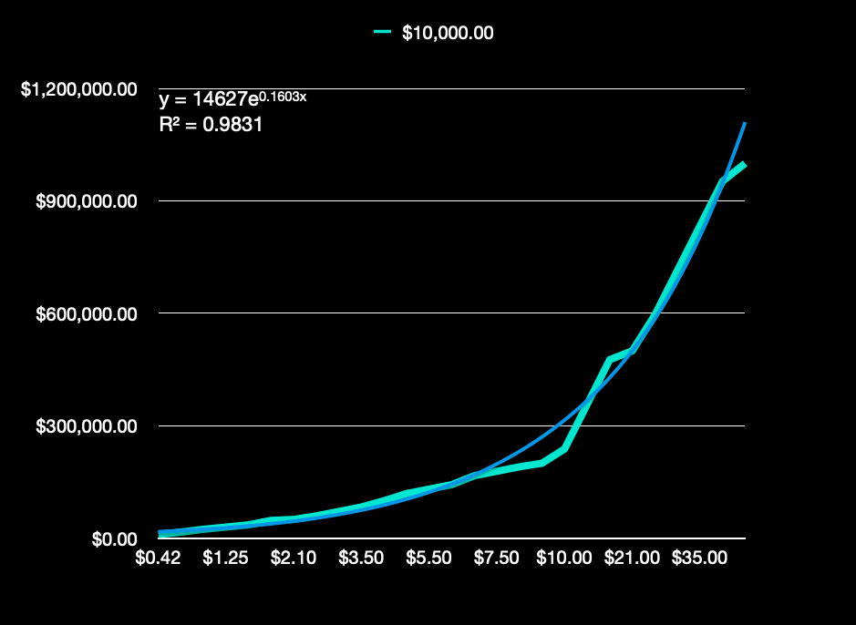

# Dogecoin the Game (Project 1 - HTML, CSS, Vanilla JS)

## May 2021
#### The concept and implementation for Dogecoin the Game was created over the course of about one week, between 08 May - 17 May 2021. Everything from the HTML pages to the main.js script was written between 10 May - 17 May 2021. 

## Idea & Code By: Bailey Leavitt

#### [Dogecoin the Game](http://dogecoin-the-game.surge.sh) | [Creator's GitHub](https://www.github.com/baileyjean) | [Creator's LinkedIn](https://www.linkedin.com/in/baileyleavitt) | [Trello Board for Project](https://trello.com/b/7AK9tUIU/vanilla-js-game)
***
## Description

#### **Dogecoin the Game** is a web-based browser board game, created for my Unit 1 capstone project in General Assembly's Software Engineering Immersive bootcamp. The game has 20 spaces, a 4-sided dice, and an 84-card *"Doge Deck"* with six distinct card types. To win, you must reach your profit goal, have a non-zero bank account, and have at least one remaining life by the time you get back to square 1. On each turn, you pull one of the cards from the *Doge Deck*. Stats are updated after each dice roll. The game uses a fun combination of *"doge-speak"* and topical meme-references throughout the user's experience. Full descriptions of the six different cards can be found on the landing page for the game!
***
## Languages Used
* HTML
* CSS
* Javascript
***
## Getting Started
* **Dogecoin the Game** is live and deployed on Surge. You can play it [here](http://dogecoin-the-game.surge.sh).
* To begin, read the instructions and narrative on the landing page for the game, then click the **JOIN THE DOGEARMY** button when you're ready.
* Select a *Profit Goal* and *Initial Investment* using the buttons on the top left and top right corners in the game board's center.
* Click the **STORT** button when you're happy with your choices. 
  * Note: you can change your initial selections as much as you want *until* you hit **STORT**. After that, the buttons disappear and your selections are displayed in their place.
* You'll know the game is active because your player piece lights up the starting square on the board. Roll the 4-sided dice to make your first move.
  * Your movement around the board is tracked by lighting up each square you land on.
* After you roll, draw a card. Your stats will begin printing in the *Game Messages* screen at the bottom of the game board's center.
  * Scroll to see previous stats and rolls.
* There are six different card types you can pull throughout the game, and each card has a different functionality. Some of these cards will send an alert to the screen, some of them will draw a Tweet on the center of the board, and all of them impact your player stats.
* Once you reach the end of the board (game begins and ends on the top left square of the board), an alert will tell you if you win or lose, then a fun, corresponding image will print over the board.
* To play again, go back to the start page (maybe try to figure out how you can adapt your initial options to improve your odds), then play again!
***
## Game Design
#### Rather than creating a new version of an existing game, I chose to create an entirely new game. I knew I wanted **Dogecoin the Game** to be a crossbreed of the board games Monopoly and Life, but choosing the right combination of profit goals and initial investments meant that I had to engineer the game with the right probabilities to produce a win for six different scenarios. In order to determine these probabilities, I created a spreadsheet to get the trend lines for each case, and designed my game cards around these numbers.
#### Much of my focus was diverted to the back-end of the game design, as there was **a lot** of logic behind the scenes. In order to keep my codebase neat and readable, the main.js file is extensively and meticulously commented with descriptions for nearly every code block. 
***
## Screenshots from the Initial Game Design Process

#### This is the first wireframe I created for the game board, as presented in my Project Pitch on 10 May 2021:

#### This is the spreadsheet used for determining trend lines:

#### These are the trend lines for each case:
##### Trend line for a starting investment of $1000

##### Trend line for a starting investment of $5000

##### Trend line for a starting investment of $10,000

***
## 
***
## Requirements
- [x] Single Player Mode
- [x] Player Class with properties to track game progess
- [x] Player Class with methods to pull cards and roll dice
- [x] Card array with unique functions for each type of card
- [x] Master deck for the game board (made up of six, smaller decks - one for each type)
- [x] Shuffled card deck
- [x] Randomized dice roll
- [x] Player movement around the board
- [x] Sorted array holding playable board positions in order
- [x] Randomized math to add or subtract to current Dogecoin price as the game is played
- [x] Pop-up messages with card info when player pulls a card
- [x] Bank Account Info display
- [x] Investment return display
- [x] Player status display
- [x] Game Loss Logic (3 Robinhood cards || Profit goal not met before end)
- [x] Game Win Logic (Reach profit goal by the end || Pull 2 Meme Lord cards)

***
## Screenshots

***

## Future Improvements & Additions
- Add a reset game button to the board so player doesn't have to refresh or navigate back to the landing page.
- Add more Tweet images so each Good/Bad Tweet is different
- Multiplayer mode
- Add a timer
- Doge or Crypto API
- Player piece animations
- Dice animations
- Card animations
- Human vs AI

## Credits
#### Tools Used:
- CANVA: [Dogecoin the Game Logo / Success Image for Win Case](https://www.canva.com/)
- STACKOVERFLOW: [Fisher-Yates Shuffle Algorithm](https://stackoverflow.com/questions/2450954/how-to-randomize-shuffle-a-javascript-array)
- SHECODES: [Background Color Gradients](https://www.csscolorgradients.com/)
- SURGE: [For Game Deployment](https://surge.sh/)

#### Inspiration:
- TWEETS: [Elon Musk's Twitter Page](https://twitter.com/elonmusk)
- DOGE (RIP): [The Original Doge Blog](https://kabosu112.exblog.jp/9944144/)
- DOGECOIN: [The Dogecoin Dev Community](https://dogecoin.com/)