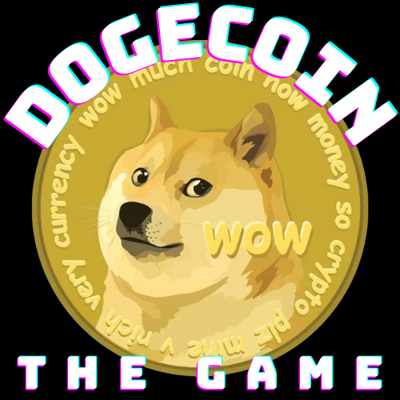
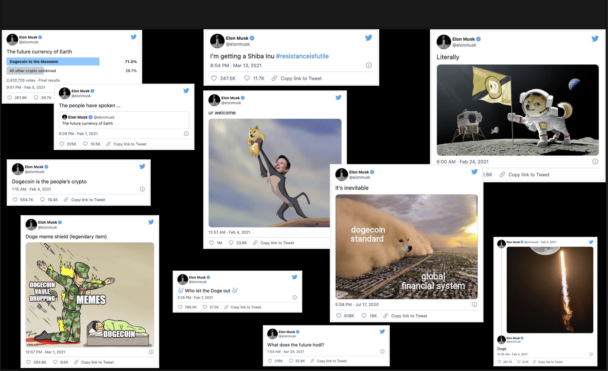
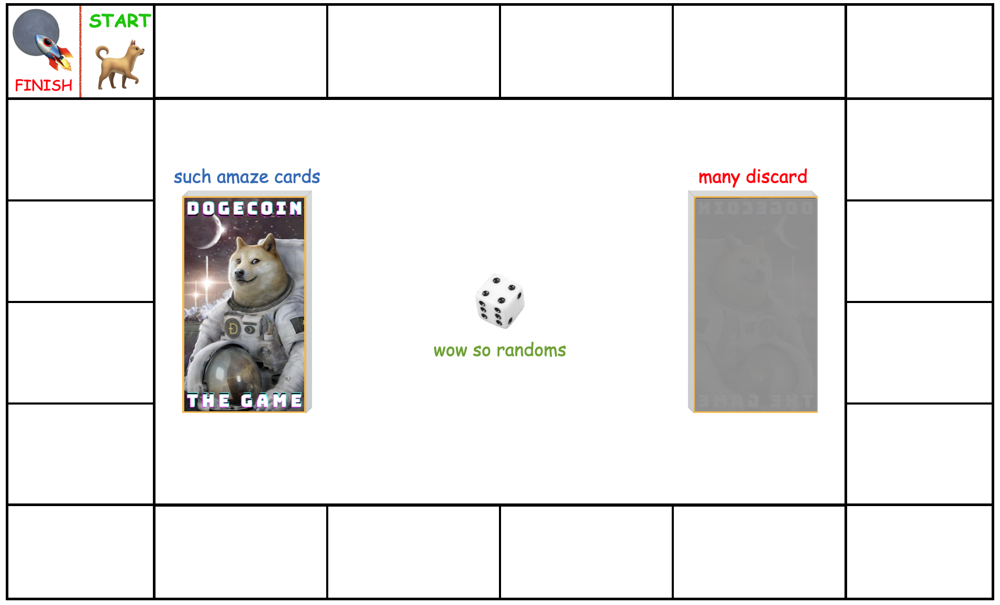

# Dogecoin the Game (Project 1 - HTML, CSS, JS)

### Date: 10 May 2021

## By: Bailey Leavitt

#### [LinkedIn](https://www.linkedin.com/in/baileyleavitt) | [GitHub](https://www.github.com/baileyjean) | [Trello](https://trello.com/b/7AK9tUIU/vanilla-js-game)

***

## HTML Decisions
#### 
***

## CSS Decisions
#### 
*** 

## Javascript Decisions
#### 
*** 

### Teachable Moments From Project
***

### Screenshots

***

### Requirements
- [] Minimum of two web pages - with navigation between them
- [] Single Player Mode: 3 profit goals to choose from at the beginning ($50k, $100k, $1mil)
- [] Bank Account/Investment Counter/Progress bar
- [] Player Object with at least three keys (bank account/doge account/cards)
- [] Randomized card deck
- [] Randomized dice roll
- [] Game Loss Logic (3 Robinhood cards = LOSE / Profit goal not met)
- [] Game Win Logic (Reach profit goal)

### Bonuses

- [] Adding a timer
- [] Multiplayer mode
- [] Doge or Crypto API
- [] Player piece animations
- [] Dice animations
- [] Card animations

### Future Improvements
-

### Credits
#### RESEARCH ON BOARD DESIGN: [StackOverflow Monopoly Board Design](https://stackoverflow.com/questions/62297465/how-to-make-a-monopoly-board-using-css-grid)
#### TWEETS: [Elon Musk's Twitter](https://twitter.com/elonmusk)
#### DOGE (RIP): [The Original Doge Blog](https://kabosu112.exblog.jp/9944144/)